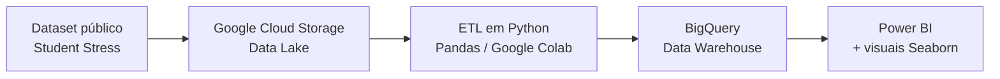
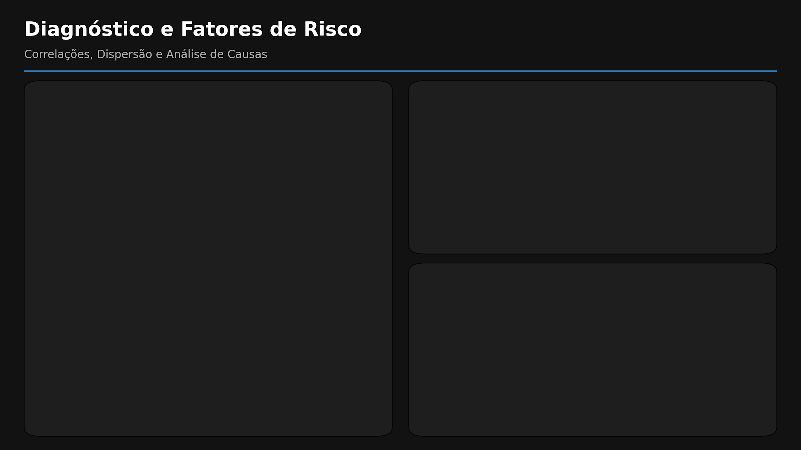
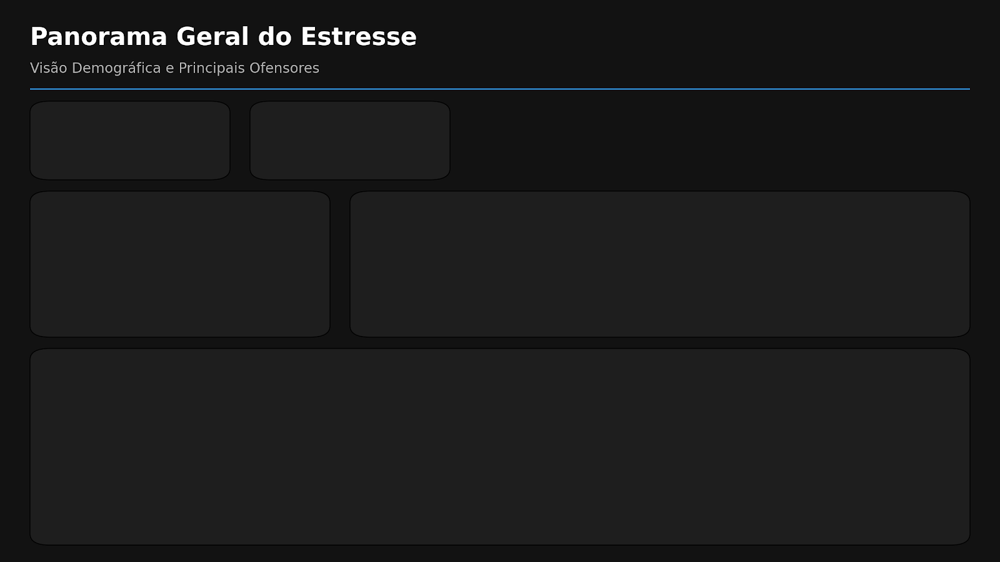
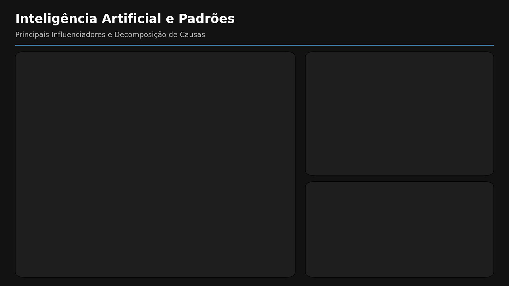

# Análise de Estresse Estudantil — Pipeline de Dados Fim-a-Fim


Projeto de **engenharia e análise de dados fim-a-fim** que transforma dados brutos de uma pesquisa sobre estresse estudantil em insights acionáveis sobre saúde mental. O fluxo cobre ingestão em nuvem, ETL em Python, modelagem em Data Warehouse e visualização analítica no Power BI — incluindo visuais estatísticos gerados via Python (Seaborn) dentro do próprio relatório.

> Desenvolvido como Atividade Extensionista do curso de Ciência de Dados (UNINTER), com aplicação nos ODS 3 (Saúde e Bem-estar) e 4 (Educação de Qualidade).

## Arquitetura



A escolha por uma arquitetura em nuvem simula um ambiente moderno de dados, com uma única fonte de verdade (*Single Source of Truth*) centralizada no Data Lake e servida ao BI por meio de um Data Warehouse.

## Os dados

Duas bases públicas de pesquisa com **843 estudantes**:

| Base | Conteúdo |
|---|---|
| `Stress_Dataset.csv` | Questionário com 24 perguntas (sintomas, hábitos, contexto acadêmico) + gênero e idade |
| `StressLevelDataset.csv` | 20 fatores numéricos (ansiedade, autoestima, sono, depressão, desempenho etc.) + nível de estresse |

> **Fonte:** dataset público "Student Stress Factors" (Kaggle). [PREENCHER com o link exato de onde você baixou]

## Pipeline ETL

1. **Ingestão** — conexão ao bucket no Google Cloud Storage e download das bases brutas.
2. **Transformação** — tradução das colunas EN→PT, padronização de tipos, correção de inconsistências (ex.: idade registrada como 100 → 20), mapeamento de gênero e tradução dos rótulos de estresse (*Eustress / Distress / No Stress* → Eustresse / Distresse / Sem Estresse).
3. **Carga** — gravação das bases tratadas de volta no GCS (pasta `tratados/`) e criação de um Data Warehouse no BigQuery (dataset `tcc_estresse_analise`, tabelas `survey_tratado` e `fatores_tratado`).
4. **Visualização** — Power BI conectado ao BigQuery, com integração de scripts Python (Matplotlib/Seaborn) para visuais que o BI não oferece nativamente (matriz de correlação e violin plot).

## Dashboard

O relatório é estruturado em três páginas, seguindo uma narrativa de **Panorama → Diagnóstico → Padrões**.

### 1. Panorama Geral do Estresse


Visão demográfica e principais ofensores. Idade média de **19,79 anos**; **65%** dos respondentes do gênero masculino. A maioria relata **eustresse** (estresse positivo, 768), com 43 sem estresse e 32 em distresse. As fontes de estresse com maior média são frequência de aulas (3,26), percepção de estresse (3,00) e problemas de sono (2,79).

### 2. Diagnóstico e Fatores de Risco


Matriz de correlação e dispersão. Em relação ao nível de estresse, os fatores de maior correlação foram:

| Fator | Correlação com o estresse |
|---|---|
| Autoestima | **−0,75** |
| Qualidade de sono | **−0,74** |
| Nível de ansiedade | **+0,73** |
| Depressão | **+0,72** |
| Desempenho acadêmico | **−0,71** |

O desempenho acadêmico médio cai de forma consistente conforme o estresse aumenta: **4,14** (nível 0) → 2,49 (nível 1) → **1,66** (nível 2).

### 3. Inteligência Artificial e Padrões


Análise de *Key Influencers* (Power BI) e violin plots. Os fatores que mais aumentam a probabilidade de um aluno estar em **distresse**:

| Quando... | Probabilidade de distresse aumenta em |
|---|---|
| Dores de cabeça > 4 | **12,86×** |
| Ansiedade/tensão > 4 | 11,62× |
| Problemas de saúde > 3 | 9,03× |
| Ambiente de trabalho > 4 | 8,77× |
| Solidão > 4 | 7,92× |
| Sobrecarga acadêmica > 4 | 6,60× |

Os violin plots evidenciaram ainda que estudantes com histórico prévio de saúde mental concentram densidade muito maior nas faixas de alta ansiedade.

## Stack técnica

- **Python** (Pandas, NumPy) — ETL e análise
- **Google Colab** — ambiente de execução
- **Google Cloud Storage** — Data Lake
- **BigQuery** — Data Warehouse
- **Power BI** — dashboard e modelagem (Fato/Dimensão)
- **Matplotlib / Seaborn** — visuais estatísticos integrados ao BI

## Estrutura do repositório

```
student-stress-analysis/
├── data/                          # Bases brutas e tratadas
│   ├── StressLevelDataset.csv
│   ├── Stress_Dataset.csv
│   ├── fatores_estresse_tratado.csv
│   └── survey_tratado.csv
├── images/                        # Páginas do dashboard
│   ├── 01-panorama.png
│   ├── 02-diagnostico.png
│   └── 03-influenciadores.png
├── notebook/
│   └── Estresse_Estudantil_Analysis.ipynb
├── powerbi/
│   └── Analise_Estresse_Estudantil.pbix
├── .gitignore
└── README.md
```

## Como reproduzir

O notebook foi escrito para o Google Colab e usa credenciais do Google Cloud. Para rodar localmente apenas a parte de análise (sem o pipeline em nuvem):

```bash
git clone https://github.com/squid10/student-stress-analysis.git
cd student-stress-analysis
pip install pandas numpy matplotlib seaborn jupyter
jupyter notebook notebook/Estresse_Estudantil_Analysis.ipynb
```

Para reproduzir o pipeline completo (GCS + BigQuery), é necessário um projeto no Google Cloud com um bucket e as credenciais configuradas.

---

Desenvolvido por **Ângelo da Silva Rosa** — [LinkedIn](https://www.linkedin.com/in/angelo-da-silva-rosa-055314267/) · [GitHub](https://github.com/squid10)
